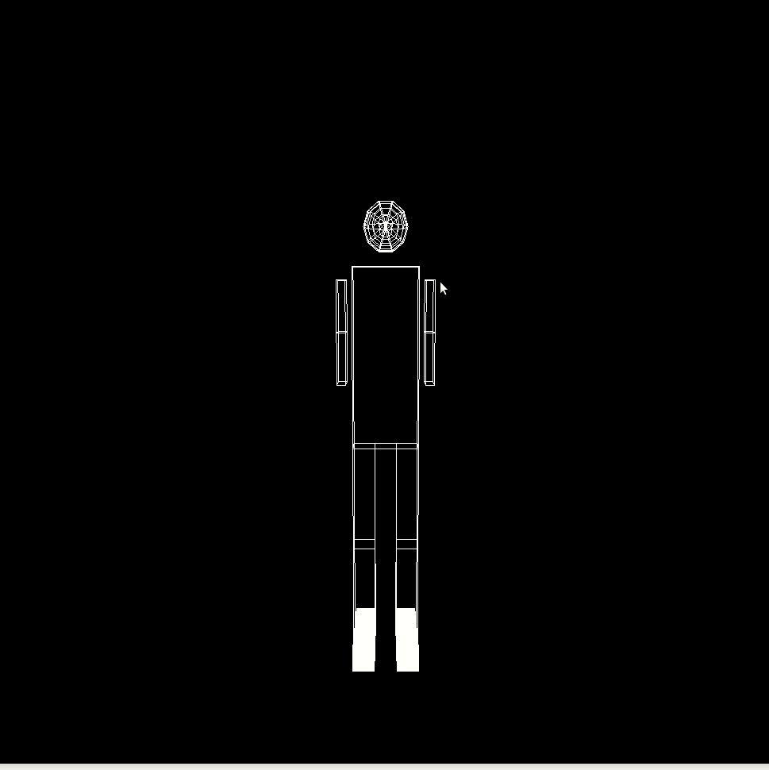
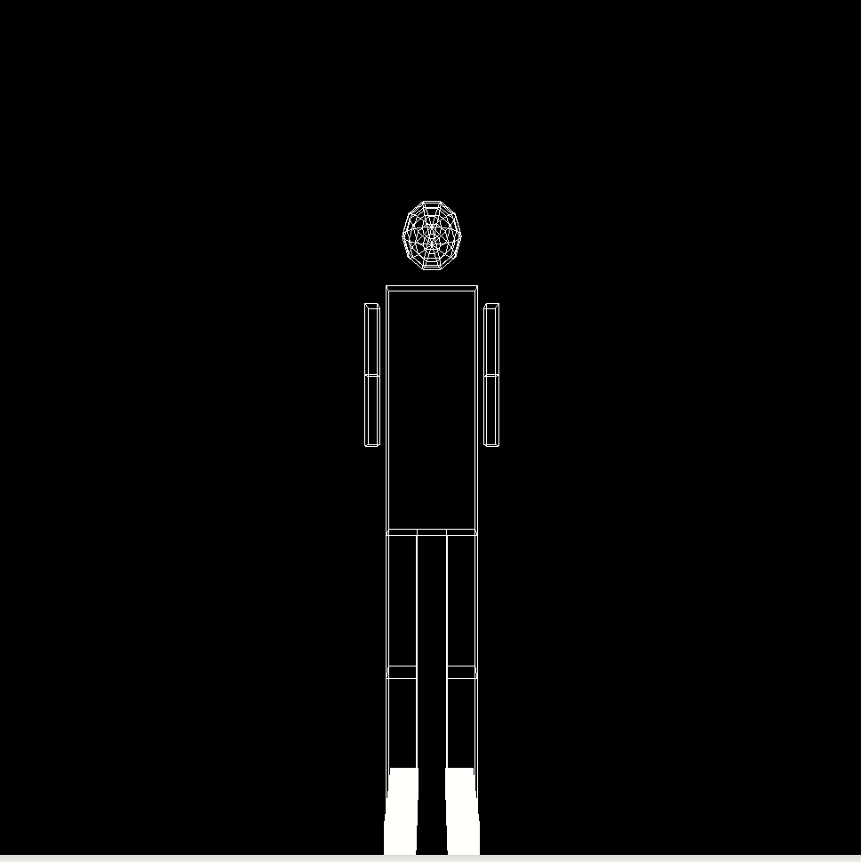

## Objectives

* Raising modelings transformation level. 
* Modeling a 3D object.
* simulation for full body joints movement.
* Report your results and comments.

## Deadline

Deadline for online submission will be  on  **Saturday 20/11/2021 11:59 PM**

## Joining to Assignment Repository

This is an individual assignment 

1. Go to the [Assignment Page](https://classroom.github.com/a/9xATPidA).
2. Accept the assignment.
3. Join your group.

## Instructions
1. use the robotic arm from assignment 1
2. the robotic arm should be complete.
3. draw a whole body with cubes and sphere for the head
4. implement the type of movements in the next gif

5. Control the camera to move around the object horizontally and vertically. Also navigate forward and backward with it as shown in the next gif. 


6. Report all details about your implementations in markdown **Report.md**. 

## Submitting

```terminal
$ git commit -a -m "solved all problems!"
$ git push origin master
```