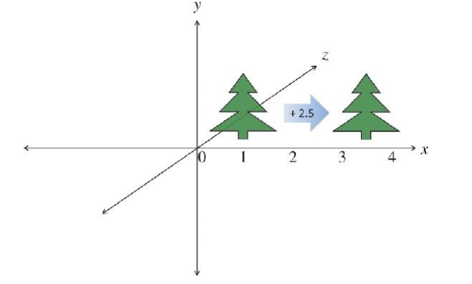
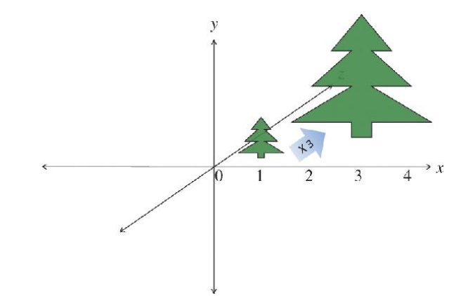
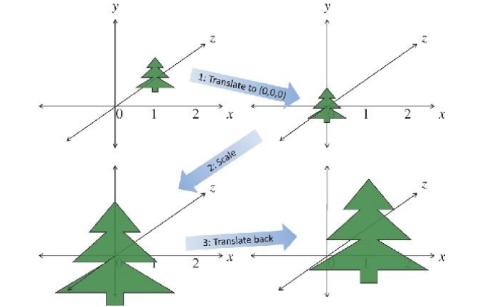
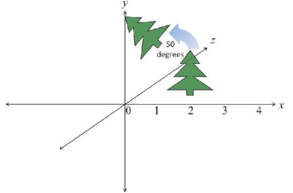
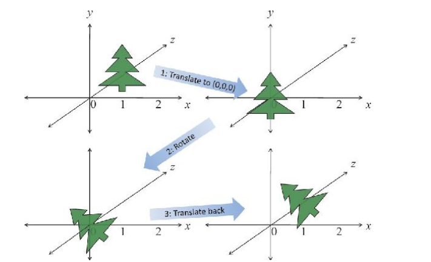
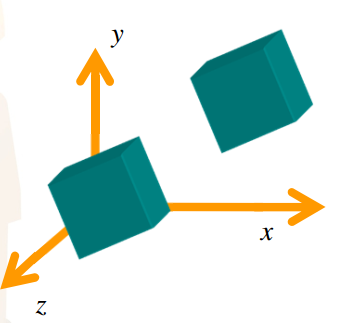
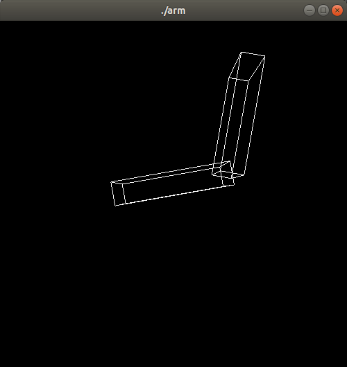

* TOC
{:toc}


### Transformations

Changing object 

* Position 
* Size 	
* Orientation 
* Shape 

Transformation is basically a matrix multiplication process and it represents the core of computer graphics.

### Translation

Changing position of the object

$$
x' = x + t_x 
$$
$$
y' = y + t_y
$$

$$
\begin{bmatrix}
x' \\ y'
\end{bmatrix}
 = 
 \begin{bmatrix}
x \\ y
\end{bmatrix}
+ 
\begin{bmatrix}
t_x \\ t_y
\end{bmatrix}

$$




### Homogeneous Coordinates 

* Adding additional dimension (Projection dimension) to current coordinate system 

* 2D Cartesian coordinate (x, y) maps to (x, y, w) homogeneous coordinate 

* 3D Cartesian coordinate (x, y, z) maps to (x, y, z, w) homogeneous coordinate 
For w = 1 homogeneous coordinates is equivalent to cartesian coordinates 


#### Advantages of homogeneous coordinates

* Make a standard (4x4) matrix shape for all vector operations including 
    * Translation 
    * Rotation 
    * Scaling 
    * Perspective Projection (Projection lecture) 

* Sequence of operation will be represented as a single matrix that will be multiplied by the vector or points. 

#### Translation in Homogeneous coordinates


Let w = 1 for now 
Transformation matrix is 4x4 matrix

$$
\begin{bmatrix}
x' \\ y' \\ z' \\ 1
\end{bmatrix} = 
\begin{bmatrix}
1 & 0 & 0 & t_x \\
0 & 1 & 0 & t_y \\
0 & 0 & 1 & t_z \\
0 & 0 & 0 & 1
\end{bmatrix} \begin{bmatrix}
x \\ y \\ z \\ 1
\end{bmatrix} 
$$

### Scaling 

Multiplying by a scale factor 

$$
\begin{bmatrix}
x' \\ y' \\ z' \\ 1
\end{bmatrix} = 
\begin{bmatrix}
S_x & 0 & 0 & 0 \\
0 & S_y & 0 & 0 \\
0 & 0 & S_z & 0 \\
0 & 0 & 0 & 1
\end{bmatrix} \begin{bmatrix}
x \\ y \\ z \\ 1
\end{bmatrix} 
$$



#### Fixed point scaling 

* Scaling operation includes translation 
* It will affect the position of the object and this is undesired effect 
* Scaling must be independent of translation. 
Solution 
1. Select a point to be fixed
2. Translate it to origin (So multiplying by zero is zero) 
3. Apply scaling 
4. Translate back to that point 

$$
P' = (T^{-1} ST)P
$$



### Rotation

For anticlockwise rotation in 2D coordinates

$$
x' = xcos(\theta) - y sin(\theta) 
$$

$$
y' = xsin(\theta) + y cos(\theta) 
$$

For 3D rotation we need to specify rotation access 

$$
R_z(\theta) = 
\begin{bmatrix}
x' \\ y' \\ z' \\ 1
\end{bmatrix} = 
\begin{bmatrix}
cos(\theta) & -sin(\theta) & 0 & 0 \\
sin(\theta) & cos(\theta) & 0 & 0 \\
0 & 0 & 1 & 0 \\
0 & 0 & 0 & 1
\end{bmatrix} \begin{bmatrix}
x \\ y \\ z \\ 1
\end{bmatrix} 
$$




#### Fixed Point Rotation

* Same concept as fixed point scaling 
* Select a point to be fixed during rotation 
Apply the following transformation matrices

$$
P' = T^{-1} RT P
$$


 * Where T is the translation of selected fixed point to origin.



**Notes :**

* Rotation matrix is orthogonal 	

$$
RR^T = I 
$$


$$
R^T = R^{-1} 
$$

* Reflection is 180  degree rotation.

### Transformation in OpenGL 

* OpenGL is a state Machine
* There is a Current matrix (CM) that holds the current state 
* There is a stack to save different states to use it when needed. 
* glTranslate — multiply the current matrix by a translation matrix (CM = CM*T)
* glScale — multiply the current matrix by a Scaling matrix (CM = CM*S)
* glRotate — multiply the current matrix by a Rotation matrix (CM = CM*R)

**Note :**

Post multiplication is applied (Right side not left side)

### Model, View, Projection 

* In World coordinates (Object) we draw our model 
* In view coordinate we put it in camera coordinates 
* In projection coordinates 3D object is projected on screen coordinate
* We handle this in openGL by setting this matrix mode sequence 

```c
glMatrixMode(GL_PROJECTION);
glMatrixMode(GL_MODELVIEW);
```

More about this in next lectures 


### Current state Manipulation


* To save the current state 
```c
glPushMatrix() 
```
* To restore that state 
```c
glPopMatrix()
```
To reset your current matrix
```c
glLoadIdentity()
```


### Cube Example

Translation and rotation 
Which first ? 




### Robotic Arm



### First Exercise

* Complete the robotic arm 
* Draw its fingers 


### Section Demo

All section demos are available [here](https://github.com/sbme-tutorials/Computer-Graphics-Tutorials/blob/master/Tutorial-02/).
