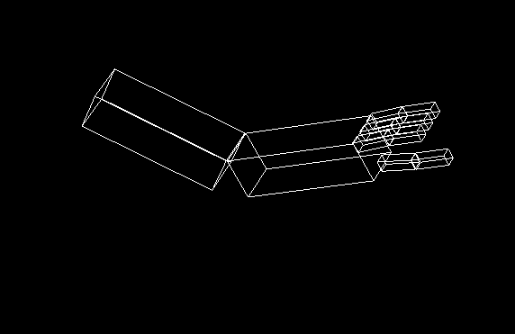

# Assignment 1

## Objectives

* Warming up with OpenGL. 
* Modeling a 3D object.
* Apply transformations to animate the model.
* Interaction with the scene using keyboard.
* Report all of that.

## Deadline

Saturday 12/3/2022. 

## Joining to Assignment Repository

1. Go to the [Assignment Page](https://classroom.github.com/a/w_asRLZa)
2. Join your group or create it
3. Wait till your repository created.

## Part 1: Programming

1. Complete the robotic arm model by adding missing fingers
2. Control arm movements using keyboard key with movement limitation according to the following table

| Key| Movement type | Notes |
|---|---|--|
|**s** | Shoulder Rotation | Abduction | 
|**S** | Shoulder Rotation | Adduction |
|**e** | elbow Rotation |Flexion|
|**E** | elbow Rotation | Extension|
|**f** | Fingers close || 
|**F** | Fingers Open || 
|**p** | Upper Phalange close || 
|**P** | Upper Phalange Open || 



**Note:**
When moving the
elbow joint you must make sure the fingers move with the arm. This is an example of
hierarchal motion. You will need to use Push and Pop to implement this correctly.

## Part 2: Written

Report all details about your implementations in markdown file (Report.md). Report must show sample results of your code. Organize the report and be concise. State issues you faced in the assignment and how you treated with it. Mention any kind of contribution of other students.


## Grading:
Most of your grade will be based on what is seen on the screen, actions taken when the keys
are pressed, and your implementation, i.e. your code. Your grade will be determined as
follows:
1. 60% on correctly drawing and manipulating the arm with the elbow joint and all fingers.
2. 10% on correctly rotation of at least one finger with limitations.
3. 10% on the remaining fingers.
5. 10% on the report.
6. 10% on answering submission questions.

## Deliverables:
1. The cpp files only.
2. The  Report.md file.

## Late Policy:
Assignments received after due date will be marked down 10%, and 5% more per day that
assignment is late. After a week no assignments will be accepted.

## Important Notes 
* You are allowed to discuss task problems with your mates. But code must be on your own.
* You can get code lines from internet and include them in your own code and you must cite the source.
* Sharing few code lines of your own with your classmates is allowed for identifying and fixing bugs, it is not allowed to see others solution before submitting.
* Report must include summary about your implementation, sample results and issues that you faced and how you fixed it.
* You must mention any kind of contribution of other mates.

## Submitting

```terminal
$ git commit -a -m "solved"
$ git push origin master
```
