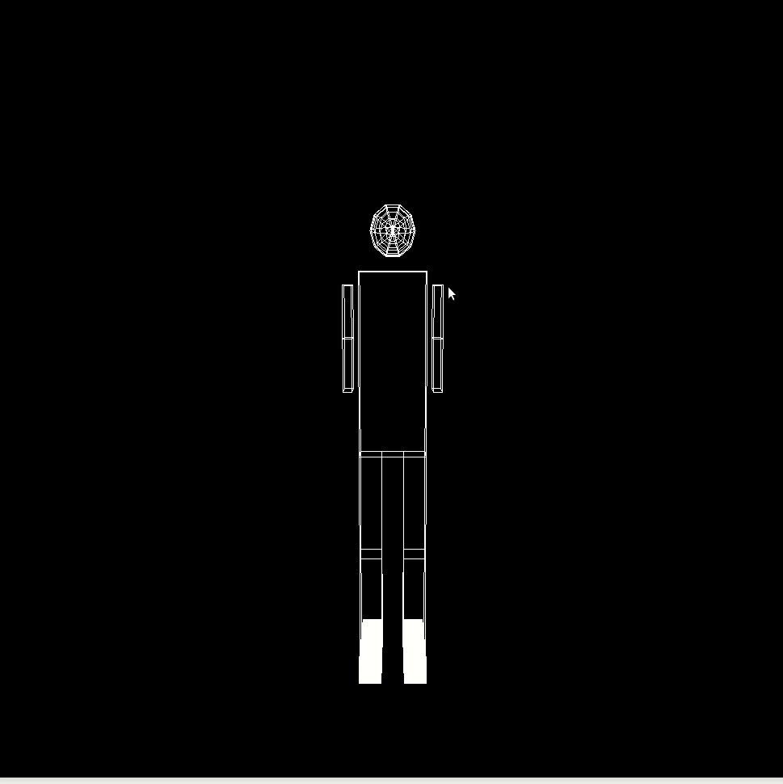

<script src="https://cdn.mathjax.org/mathjax/latest/MathJax.js?config=TeX-AMS-MML_HTMLorMML" type="text/javascript"></script>


## Objectives

* Raising modeling adn transformation level. 
* Camera movements
* Animation with timer function.
* simulation for full body joints movement.
* Report your results and comments.

## Deadline

Deadline for online submission will be  on  **Wednesday 29/3/2022 11:59 PM**

## Joining to Assignment Repository


1. Go to the [Assignment Page](https://classroom.github.com/a/CBVRqMyR).
2. Accept the assignment.
3. Join your group.

## Part 1: Programming
1. use the robotic arm from assignment 1 (the robotic arm should be complete with its fingers)
2. draw a whole body with cubes and sphere for the head
3. implement the type of movements in the next gif

4. Control the camera to move around the object horizontally and vertically. Also navigate forward and backward with it as shown in the next gif. 

5. Press the **space bar** one time to run the raising arm animation then press it again to down them like the following gif. (use **glutTimerFunction** for this animation).


6. Control Keys

| Key| Movement type | Notes |
|---|---|--|
|**$$\uparrow$$** | Camera rotation up |  | 
|**$$\downarrow$$** | Camera rotation down|  | 
|**$$\rightarrow$$** | Camera rotation right |  | 
|**$$\leftarrow$$** | Camera rotation left |  | 
|**f** | move camera forward|  | 
|**b** | move camera backward |  | 
|**Space Bar** | Start/Stop animation | | 
|**s** | Shoulder Rotation | Abduction | 
|**S** | Shoulder Rotation | Adduction |
|**e** | elbow Rotation |Flexion|
|**E** | elbow Rotation | Extension|
|**k** | Knee rotation Leg1 | Flexion| 
|**K** | Knee rotation Leg1 | Extension| 
|**n** | Knee rotation Leg2 | Flexion| 
|**N** | Knee rotation Leg2 | Extension| 
|**h** | Hip rotation Leg1 | Abduction| 
|**H** | Hip rotation Leg1 | Adduction| 
|**i** | Hip rotation Leg2 | Abduction| 
|**I** | Hip rotation Leg2 | Adduction| 

## Part 2: Written

Report all details about your implementations in markdown file (**Report.md**). Report must show sample results of your code. Organize the report and be concise. State issues you faced in the assignment and how you treated with it. Mention any kind of contribution of other students.

## Grading:
Most of your grade will be based on what is seen on the screen, actions taken when the keys
are pressed, and your implementation, i.e. your code. Your grade will be determined as
follows:
1. **60%** on correctly drawing and manipulating the robot with its joints.
2. **10%** on correct rotation of joints with limitations.
3. **10%** on correct camera movements.
5. **10%** correct animation with the timer function and keyboard.
6. **10%** on answering submission questions.

## Deliverables:
1. The cpp files only.
2. The  Report.md file.

## Late Policy:
Assignments received after due date will be marked down 10%, and 5% more per day that
assignment is late. After a week no assignments will be accepted.

## Submitting

```terminal
$ git commit -a -m "solved all problems!"
$ git push origin master
```