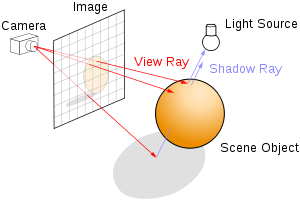
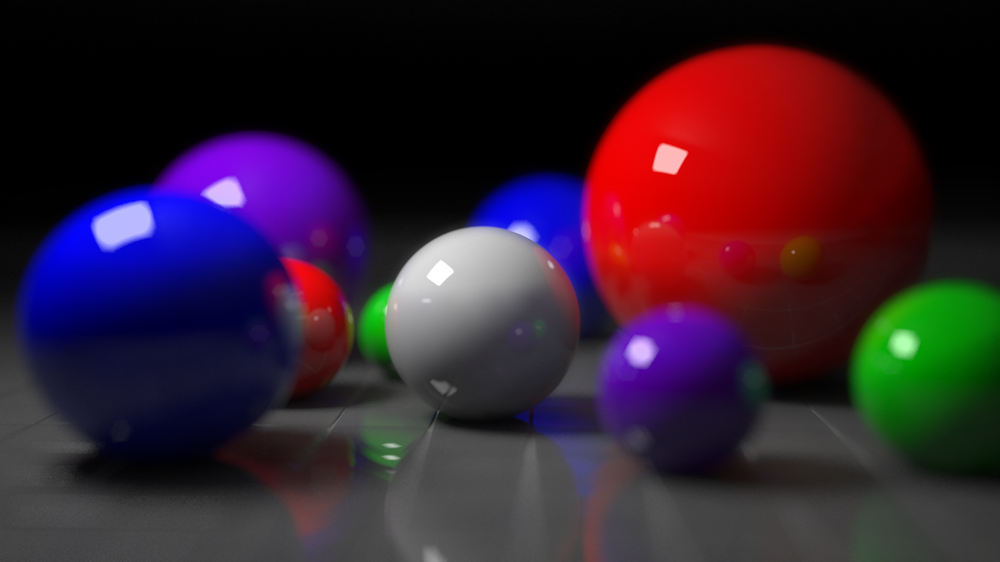
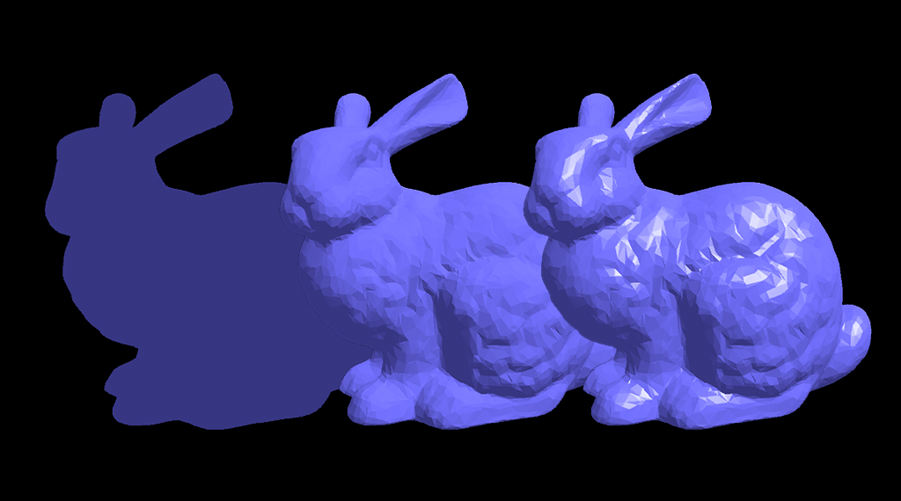

* TOC
{:toc}

## Ray Casting

### Vision Process

In human vision process is as follow

1. Lights drop on objects
2. Then it is reflected (scattered) in all directions
3. Reflected light rays are received by the eye and image is formed.

The same is for the pinhole camera model


**Ideally**

* There is an infinite number of rays 
* Multiple reflections happen for the same ray on different objects 

So how we simulate this in computer graphics ?
Keep in mind that the objective is to get a 2D image of the scene. 

### Ray Casting

**Basic Idea**
The process is reversed where rays are sent from the camera position instead of receive it at the camera position. 

Pseudo code for ray casting  
```python 
for each pixel:
    Send a ray through the scene
    Find the interection with objects 
    Calculate the color at this intersection 
    Assign this color to that pixel where ray was sent from
```



### Ray Tracing


* It is the same idea with more complex calculations
* Rays must be checked with all objects in the scene by tracking its reflections recursively. 

* It is computationally extensive and time-consuming process but has realistic results

* It is used for creating visual effects and not applicable in interactive applications (Games)


Sample of generated images with ray tracing [(source)](https://en.wikipedia.org/wiki/Ray_tracing_(graphics))





## Lighting and materials 

### Classical lighting model

* Ambient lighting : 
It is an approximation of environmental light that comes from all direction and there is no direct light source. This light bounces through the scene equally. As a result, it illuminate all objects equally. It's like a fading light. 
* Diffuse lighting
The light that comes from a specific light source and reflected in all direction due to the roughness of the surface. 

* Specular lighting:
This light comes from a particular direction and perfectly reflect on the surface. Such effect is clear for the smooth surfaces.




**Enabling lightening in OpenGL**

* First, we need to define the light properties by defining RGB color for the ambient, diffuse, and specular components. 

```c
// Here we have a white light source
float light_ambient[] = {1.0, 1.0, 1.0, 1.0};
float light_diffuse[] = {1.0, 1.0, 1.0, 1.0};
float light_specular[] = {1.0, 1.0, 1.0, 1.0};
```
* We need also to define the position of thr light source in our scene.

```c
// This is the light position
float light_position[] = {0.0, 0.0, 4.0, 1.0};
```

* Second, Specify and assign the light properties including the position to a specific light source.

```c
// Setting light source properties and enabling it
glLightfv(GL_LIGHT1, GL_POSITION, light_position);
glLightfv(GL_LIGHT1, GL_AMBIENT, light_ambient);
glLightfv(GL_LIGHT1, GL_DIFFUSE, light_diffuse);
glLightfv(GL_LIGHT1, GL_SPECULAR, light_specular);

```

* Finally, We need to enable that light source and enable lighting in general. 

```c
glEnable(GL_LIGHT1);
glEnable(GL_LIGHTING);
```

### Defining material properties. 

* We've seen how to create light sources and assign specific ambient, diffuse, and specular properties. 

* We also need to define the properties of the objects in the scene in terms of ambient, diffuse, specular, emission, and shines. 

* First define the object properties. 

```c
GLfloat material_ambient[] = {0.1, 0.01, 0.01, 1.0},
        material_diffuse[] = {0.3, 0.01, 0.01, 1.0},
        material_specular[] = {1, 0.01, 0.01, 1.0},
        material_shininess = 30;

```

* Second, assign it to the object material

```c
 glMaterialfv(GL_FRONT, GL_AMBIENT, material_ambient);
  glMaterialfv(GL_FRONT, GL_DIFFUSE, material_diffuse);
  glMaterialfv(GL_FRONT, GL_SPECULAR, material_specular);
  glMaterialf(GL_FRONT, GL_SHININESS, material_shininess);
```

### Red light sphere Demo 
This is an example of a solid sphere 

**No light sources**


**Only ambient is set**


**Ambient, diffuse**


**Ambient, diffuse, and specular**


**Note**

The overall appearance of the object is determined by both  material and light properties. 
### Shading models


There are two types of shading:
* Flat shading where each facet is shaded with its color and in between edges will appear. This is due to the color differences between facets. 

```c
glShadeModel(GL_FLAT);
```

* Gouraud shading (Smooth) where the color of the in between edges is an interpolation of the color of the surrounding facets. As a result, no clear edges are seen. It looks smooth.
```c
glShadeModel(GL_SMOOTH);
```

By default, shading is smooth. 


References:

https://www.khronos.org/registry/OpenGL-Refpages/gl2.1/xhtml/glLight.xml

<!-- ## Animation Key concept 

The key concept of animation is to compose a set of frame with different poses of the model and blend these frames one after another to get the object animated. 

Think of it like video capturing. You capture multiple frames through time and view these frames in a specific rate (Frame rate).

Frame by frame animation

[Useful tutorial](https://www.youtube.com/watch?v=f3Cr8Yx3GGA)

For example this is first pose


And this is the second pose


And this is the third pose 


and so on 

When we run these poses with time it will seem that the object is moving.


### Section Demo

All demos will be available in [this](https://github.com/sbme-tutorials/SBE306-Computer-Graphics-Tutorials) repository -->